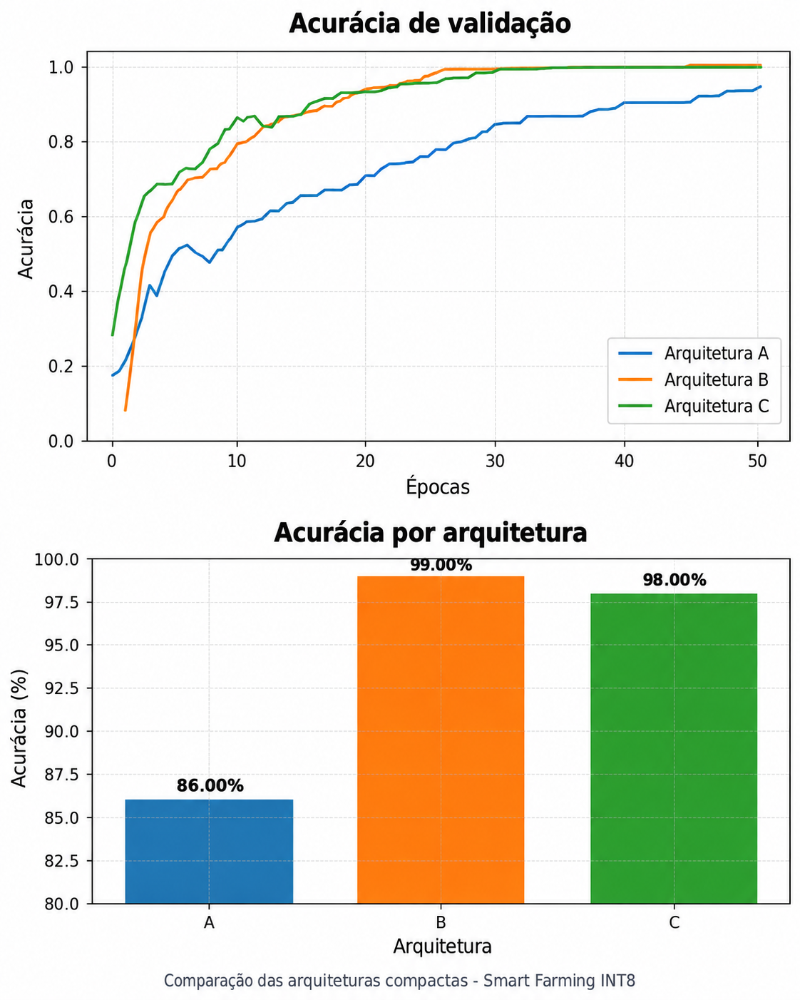
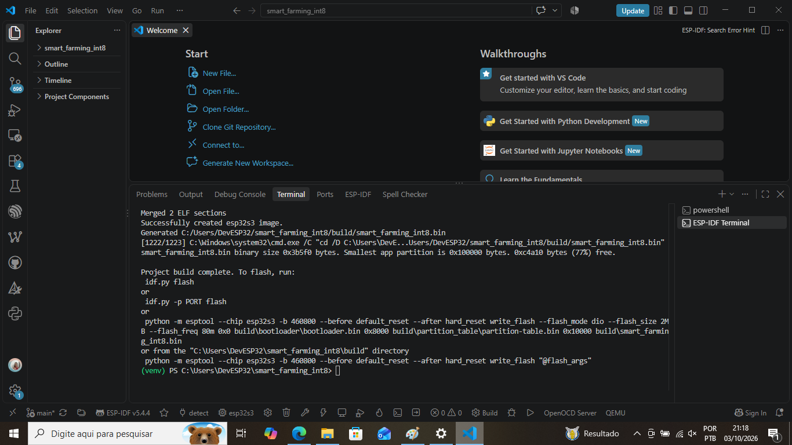
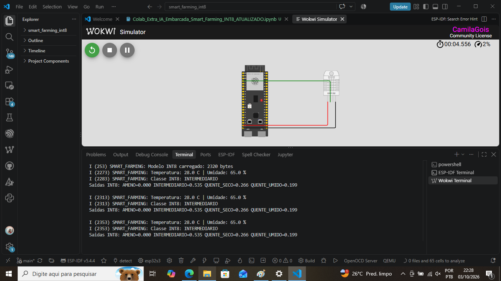
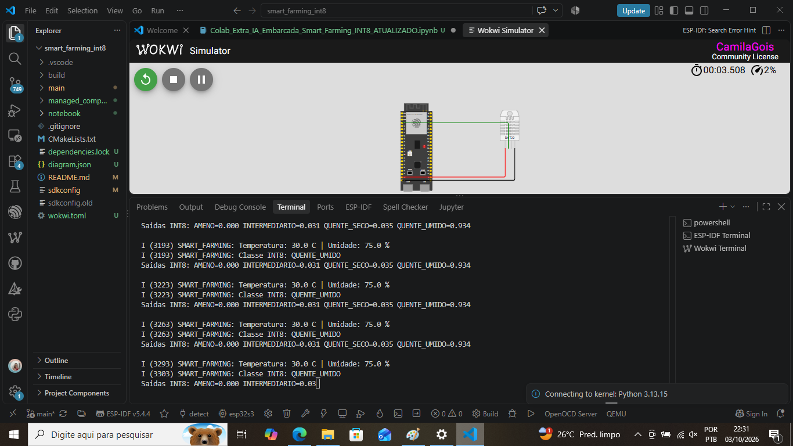

# Smart Farming INT8 com ESP32-S3

Projeto desenvolvido para a disciplina **IA Embarcada e Modelos Compactos**, da Pós-Graduação em IA e Ciência de Dados do **SENAI/SC**.

O objetivo foi aplicar um fluxo completo de IA embarcada, desde a preparação dos dados até a integração de um modelo quantizado em um microcontrolador.

A aplicação utiliza **temperatura** e **umidade** para classificar condições ambientais em um cenário didático de Smart Farming.

**Fluxo do projeto:**

```text
Dataset → Exploração → Treinamento → Comparação de arquiteturas → TensorFlow Lite
→ Quantização INT8 → ESP32-S3 → TensorFlow Lite Micro → Wokwi
```

> As classes ambientais definidas neste projeto são didáticas e não representam diagnóstico ou recomendação agronômica.

---

## 1. Objetivo

O objetivo do projeto é desenvolver uma aplicação de IA embarcada capaz de utilizar dados ambientais para realizar uma classificação diretamente no **ESP32-S3**.

Além da acurácia, também foram considerados aspectos importantes para execução na borda, como número de parâmetros, tamanho do modelo, representação numérica, uso de TensorFlow Lite, quantização INT8 e integração com TensorFlow Lite Micro.

---

## 2. Dataset

Foi utilizado o dataset **Smart Farming Sensor Data for Yield Prediction**, de **Atharva Soundankar**, disponível no Kaggle.

Fonte: https://www.kaggle.com/datasets/atharvasoundankar/smart-farming-sensor-data-for-yield-prediction

A base possui **500 registros e 22 colunas** relacionadas a agricultura inteligente. Para esta aplicação foram utilizadas apenas duas variáveis:

- `temperature_C`
- `humidity_%`

A escolha dessas duas entradas permite reproduzir o mesmo tipo de informação com um sensor ambiental conectado ao ESP32-S3.

---

## 3. Contextualização

Em aplicações de **Smart Farming**, sensores podem realizar medições contínuas das condições ambientais. Em vez de enviar todos os dados para processamento em servidores externos, parte da análise pode ser feita diretamente no dispositivo embarcado.

Essa abordagem é conhecida como **Edge AI**.

Neste projeto, o ESP32-S3 executa localmente um modelo compacto que recebe temperatura e umidade como entradas e produz uma classificação da condição termo-higrométrica.

---

## 4. Classes utilizadas

Para transformar a base em um problema de classificação, foi criada a variável `condicao_ambiental`.

| Classe | Condição |
|---|---|
| **AMENO** | Temperatura abaixo de 22 °C |
| **QUENTE_SECO** | Temperatura ≥ 28 °C e umidade < 65% |
| **QUENTE_UMIDO** | Temperatura ≥ 28 °C e umidade ≥ 65% |
| **INTERMEDIARIO** | Demais condições |

As classes foram criadas apenas para fins didáticos dentro da atividade.

---

## 5. Preparação dos dados

Antes do treinamento foram realizadas seleção das variáveis, conversão para valores numéricos, verificação de valores ausentes, remoção de duplicidades, codificação das classes com `LabelEncoder`, divisão estratificada em treino e teste e normalização com `StandardScaler`.

A divisão utilizada foi de **80% para treinamento** e **20% para teste**.

Os parâmetros de média e desvio-padrão usados na normalização também foram armazenados para serem reutilizados na etapa embarcada.

---

## 6. Comparação de arquiteturas compactas

Foram avaliadas três arquiteturas de redes neurais densas:

| Arquitetura | Estrutura | Acurácia |
|---|---|---:|
| **A** | Entrada(2) → Dense(4) → Saída | 86% |
| **B** | Entrada(2) → Dense(8) → Saída | **99%** |
| **C** | Entrada(2) → Dense(8) → Dense(4) → Saída | 98% |

O treinamento utilizou Adam com `learning_rate=0.001`, até 150 épocas, `batch_size=16`, `validation_split=0.20` e `EarlyStopping` com `patience=15` e restauração dos melhores pesos.

Foram comparados acurácia, loss, quantidade de parâmetros, número de épocas e tamanho do arquivo TensorFlow Lite.

O critério de seleção considerou equivalentes os modelos com até **1 ponto percentual** abaixo da melhor acurácia. Entre eles, foi priorizado o modelo com menor complexidade.

A **Arquitetura B** foi selecionada, com **60 parâmetros** e **99% de acurácia**.

### Comparação dos modelos



---

## 7. Avaliação do modelo

O notebook inclui avaliação detalhada com `classification_report`, contendo **precision, recall e F1-score**, além de matriz de confusão do modelo selecionado.

Também foi adicionada uma avaliação específica do modelo quantizado INT8, com nova matriz de confusão e comparação direta com as previsões da versão Float32.

A concordância entre Float32 e INT8 foi calculada para verificar se a quantização alterou as decisões do modelo nas mesmas amostras de teste.

---

## 8. TensorFlow Lite e quantização INT8

Após o treinamento, o modelo selecionado foi convertido para TensorFlow Lite em duas versões:

```text
smart_farming_float32.tflite
smart_farming_int8.tflite
```

A versão final usada na etapa embarcada foi quantizada para **INT8**.

Foi utilizada quantização inteira completa com um `representative_dataset` construído a partir de amostras normalizadas do conjunto de treinamento. A conversão foi configurada com operações, entrada e saída em INT8.

### Comparação Float32 × INT8

| Indicador | Float32 | INT8 |
|---|---:|---:|
| Arquitetura | B | B |
| Parâmetros | 60 | 60 |
| Acurácia | **99,00%** | **99,00%** |
| Tamanho | **1,92 KB** | **2,27 KB** |
| Entrada/saída | float32 | int8 |

A quantização manteve a acurácia em **99%**, portanto não houve perda de desempenho no conjunto de teste.

Neste modelo muito pequeno, o arquivo INT8 ficou ligeiramente maior que o Float32. Isso ocorre porque o overhead do próprio formato TFLite tem peso relevante quando a rede possui poucos parâmetros. Por isso, neste experimento, não é correto afirmar que a quantização reduziu o tamanho do arquivo.

---

## 9. Arquivos gerados para a etapa embarcada

Os principais artefatos produzidos foram:

```text
smart_farming_float32.tflite
smart_farming_int8.tflite
model_data.cc
model_data.h
model_config.h
model_metadata.json
```

O arquivo `model_config.h` armazena médias, desvios, `scale`, `zero_point` e nomes das classes necessários para reproduzir no ESP32-S3 o mesmo pré-processamento realizado no Colab.

O modelo INT8 carregado no ESP32-S3 possui **2320 bytes**.

---

## 10. Implementação no ESP32-S3

A etapa embarcada utiliza:

- **ESP32-S3 DevKitC-1**;
- **ESP-IDF 5.4.4**;
- componente `espressif/esp-tflite-micro`;
- **TensorFlow Lite Micro**;
- modelo quantizado INT8;
- sensor **DHT22** em `GPIO4`;
- componente `esp-idf-lib/dht` para leitura do sensor.

O projeto foi configurado para o target `esp32s3` e o **build foi concluído com sucesso**, gerando:

```text
build/smart_farming_int8.bin
build/smart_farming_int8.elf
```

Também foi gerado um firmware unificado em formato UF2 com:

```powershell
idf.py uf2
```

resultando em:

```text
build/uf2.bin
```

Esse arquivo foi utilizado para validar o firmware diretamente no Wokwi pelo navegador.

### Build final



---

## 11. Simulação no Wokwi

A simulação utiliza **ESP32-S3 + DHT22**.

Conexões do sensor:

| DHT22 | ESP32-S3 |
|---|---|
| VCC | 5V |
| GND | GND |
| SDA | GPIO4 |

O Serial Monitor foi configurado pela UART do ESP32-S3 e o firmware foi carregado no Wokwi com o arquivo `uf2.bin`.

Na validação realizada no navegador, o firmware iniciou corretamente e o TensorFlow Lite Micro carregou o modelo INT8:

```text
SMART_FARMING: Smart Farming INT8 iniciado.
SMART_FARMING: ESP32-S3 + DHT22 + TensorFlow Lite Micro
SMART_FARMING: Modelo INT8 carregado: 2320 bytes
```

A leitura do DHT22 apresentou falha quando foi utilizada a rotina manual de temporização. Por isso, a leitura foi substituída pelo componente `esp-idf-lib/dht`, mais adequado para o ESP32-S3.

A inferência só é executada quando uma leitura válida de temperatura e umidade é obtida.

### Circuito no Wokwi


### Inferência INT8

A evidência final deve registrar temperatura, umidade e a classe prevista pelo modelo INT8 no Serial Monitor.



---


### Variação das classes previstas

Para verificar o comportamento do modelo com diferentes condições ambientais, os valores de temperatura e umidade foram alterados durante a simulação.

O modelo respondeu às mudanças das entradas e apresentou diferentes classificações, demonstrando que a inferência embarcada estava sendo executada de forma dinâmica.



## 12. Estrutura principal do projeto

```text
smart_farming_int8/
│
├── .vscode/
│
├── docs/
│   ├── imagens/
│   │   ├── 01_colab_comparativo_int8.png
│   │   ├── 01_reconfigure_concluido_espidf.png
│   │   ├── 02_target_esp32s3_configurado.png
│   │   ├── 02_build_final_esp32s3_tflite.png
│   │   ├── 03_build_esp32s3_concluido.png
│   │   ├── 03_uf2_gerado_esp32s3.png
│   │   ├── 04_wokwi_esp32s3_dht22.png
│   │   ├── 04_wokwi_inferencia_int8.png
│   │   └── 05_wokwi_variacao_classes.png
│   │
│   └── relatorio/
│       ├── Relatorio_Smart_Farming_INT8_ATUALIZADO.docx
│       └── Relatorio_Smart_Farming_INT8_ATUALIZADO.pdf
│
├── main/
│   ├── CMakeLists.txt
│   ├── idf_component.yml
│   ├── main.cpp
│   ├── model_config.h
│   ├── model_data.cc
│   ├── model_data.h
│   ├── model_metadata.json
│   └── smart_farming_int8.tflite
│
├── managed_components/
│   ├── esp-idf-lib__dht/
│   ├── esp-idf-lib__esp_idf_lib_helpers/
│   ├── espressif__esp-nn/
│   └── espressif__esp-tflite-micro/
│
├── notebook/
│   └── Colab_Extra_IA_Embarcada_Smart_Farming_INT8_ATUALIZADO.ipynb
│
├── .gitignore
├── CMakeLists.txt
├── dependencies.lock
├── diagram.json
├── README.md
├── sdkconfig
├── sdkconfig.old
└── wokwi.toml

----

### 14. Conclusão

O projeto percorreu um fluxo completo de IA embarcada, desde a exploração do dataset até a execução do firmware no ESP32-S3.

A arquitetura **B** apresentou o melhor equilíbrio para a aplicação, com **60 parâmetros e 99% de acurácia**. A versão INT8 manteve os mesmos **99%**, mostrando que a quantização preservou o desempenho neste experimento.

O arquivo INT8 ficou com aproximadamente **2,27 KB**, enquanto o Float32 ficou com **1,92 KB**. Embora o INT8 não tenha reduzido o tamanho do arquivo neste caso, ele permitiu preparar entrada, saída e operações em representação inteira para execução com TensorFlow Lite Micro.

Na etapa embarcada, o build para ESP32-S3 foi concluído com sucesso, o firmware UF2 foi gerado e o Wokwi confirmou a inicialização do firmware e o carregamento do modelo INT8 de **2320 bytes**. A leitura do DHT22 foi então migrada para um driver específico do ESP-IDF para finalizar a aquisição dos dados do sensor e a inferência completa no simulador.


*Autora: Camila Gois de Jesus
*Curso: Pós-Graduação em IA e Ciência de Dados
*Instituição: SENAI/SC
*Disciplina: IA Embarcada e Modelos Compactos
*Professor: Rodrigo Kobashikawa
*Ano: 2026
